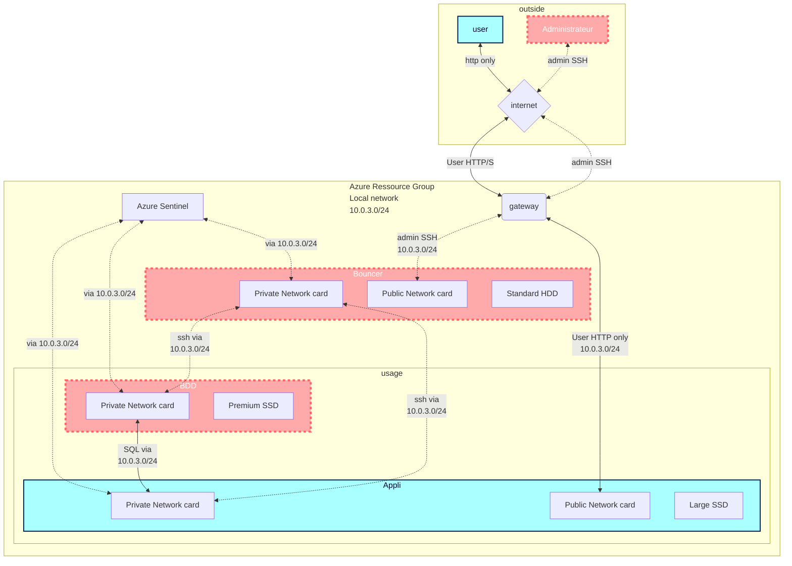

# Collaborative creation of Nextcloud VMs

    Demande utilisateur :

    Dans le cadre du projet “LifeSense”, nous avons besoin d’échanger des gros fichiers (plusieurs GO). Nous souhaitons le faire sans 
    passer par un drive tierce, de façon simple par un navigateur web, avec des accès sécurisés par utilisateur.

## ***Sommaire***

***[1 - Topologie du réseau sur Azure en Flowchart](#NetFlo)*** 

***[2 - Ressources nécessaires prévues](#Res)***

***[3 - Plan d'action](#Actplan)***

***[4 - Création d'une VM via le portail Azure](#Crea)***

***[X - Commandes prévues](https://github.com/simplon-lanloBaptiste/Brief2_groupe3/blob/main/Commandes%20pr%C3%A9vues)***

## ***1 - Topologie du réseau sur Azure en Flowchart***

[Retour au sommaire](#home)

## ***2 - Liste des ressources Azure prévues à déployer***

    - 3 VM Ubuntu 20
            - 1 VM Admin bastion pour accès SSH aux autres VMs avec
                - 1vCPU
                - 3.5Gb RAM
                - 1 disque OS 30Gb standard HDD
                - 1 disque data 32Gb standard HDD
            - 1 VM Appli avec 
                - 2vCPU
                - 8Gb RAM
                - 1 disque OS 30Gb standard HDD
                - 1 disque data 256Gb Premium SSD
            - 1 VM de Base de Donnée en MariaBD avec
                - 2vCPU
                - 16Gb RAM
                - 1 disque OS 30Gb standard HDD
                - 1 disque data 32Gb standard SSD
    - 1 virtual network
        - masque de sous réseau 10.0.3.0/24
    - 1 virtual gateway
    - 3 adresses IP publiques (1 temporaire), cf table ip ci dessous
    - 1 Azure Sentinel  

Table d'adressage IP :  

| VM | Private IP | Public IP |
| :--- | :---: | ---: |
| Admin | 10.0.3.4 | 20.150.147.129 |
| Appli | 10.0.3.5 | 20.118.188.191 |
| BDD | 10.0.3.6 | 20.125.132.145 |

[Retour au sommaire](#home)

## ***3 - Plan d'action :***

- [x] Planifier les actions et quelles ressources mettre en place
 
- [x] Créer le schéma réseau

        - Création des clés SSH

        - Créer 3 VMs pour NextCloud
            - 1 VM Admin
            - 1 VM BDD
            - 1 VM Applicative

        - Configurer les accès au réseau des VMs
            - Modifier les ports d'accès (10022 au lieu de 22/ 10080 au lieu de 80...)
            - Couper l'accès SSH public aux VMs Appli et BDD

        - Installation des prérequis (PHP, Apache)
        Créer une base de données MariaDB sur la VM BDD
        Déployer NextCloud sur la VM Applicative

        - Créer les utilisateurs/groupes et accorder les droits d’accès
 
        - Tester la structure
            - Accès au portail web NextCloud en tant que "user" (http/10080)
            - Vérification du logging d'Azure Sentinel
            - Test de disponibilité Application Insights

        - Accès à l'application via TLS (HTTPS)

        - Création des différentes documentations

        - Répondre au client

Commentaire : représenter le réseau à déployer sous forme de tableau (adressages IPs, ports, etc)

[Retour au sommaire](#home)

## ***4 - Création d'une VM via le portail Azure***

### ***4-1. Informations basiques***
___
All resources > Create > Virtual machine  

  

Choisir "subscription" et "resource group"  

  

Choisir un nom pour la VM, la "Region" (localisation des services), l'image...  

  

Créer un compte admin (user name, password)  

  

Puis choisir les règles de port entrantes (HTTP/HTTPS/SSH)  

### ***4-2. Disques***
___
Choisir un type de disque système :  

  

Puis ajouter au moins 1 disque DATA :  

  

  

### ***4-3. Réseau***
___
Choisir le "virtual network", le "subnet" et l ressource Azure "public ip" (faire "new" si pas de ressource déjà existante)  

  

Choisir quels ports entrants seront autorisés au déploiement de la VM :  

  

### ***4-4. Création de la VM***
___
Si tout est conforme, passer à "review and create", un résumé du produit et du prix est visible (voir screenshot), et toutes les informations relatives à la VM sont résumées plus bas dans la page du portail Azure  

  

### ***4-5. Vérification des ressources***
___
Si tout s'est bien déroulé, nous allons pouvoir retrouver la vm et les ressources automatiquement créées dans "all resources", en filtrant sur notre "resource group" :  

  

  

Exemple :  

| NAME | TYPE | RESOURCE GROUP | LOCATION | SUBSCRIPTION |
| --- | --- | --- | --- | --- |
| VMAdminB2G3 | Virtual machine | brief_2_groupe_3 | West US 3 | Simplon OCC Montpellier ADMIN CLOUD |
| VMAppliB2G3 | Virtual machine | brief_2_groupe_3 | West US 3 | Simplon OCC Montpellier ADMIN CLOUD |

[Lien vers l'extract en .csv](https://github.com/simplon-lanloBaptiste/Brief2_groupe3/blob/main/DOC/AzureresourcesBrief2.csv)  

[Retour au sommaire](#home)

