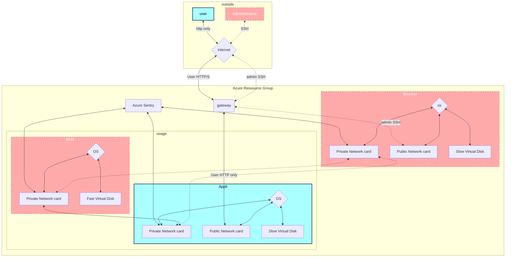

# Collaborative creation of Nextcloud VMs

## ***1 - Topogragie du réseau sur Azure en Flowchart***

```mermaid
flowchart TD

    subgraph rg1 [Azure Ressource Group]
        
        subgraph use [usage]

        subgraph bdd1 [BDD]
            priv_1[Private Network card]
            virt_1[Fast Virtual Disk]
            os_1{OS}
        end
        
        subgraph app1 [Appli]
            priv_2[Private Network card]
            pub_2[Public Network card]
            virt_2[Slow Virtual Disk]
            os_2{OS}
        end

        end

        subgraph  admin1 [Bouncer]
            priv_3[Private Network card]
            pub_3[Public Network card]
            virt_3[Slow Virtual Disk]
            os_3{os}
        end

        gw(gateway)
        sentry[Azure Sentry]

        

    end
    
    subgraph outside[outside]
        usr[user]
        admin[Administrateur]
        web{internet}
    end

    usr <-->|http only| web
    admin <-.->|SSH| web
    
    web <-->|User HTTP/S| gw
    web <-.->|admin SSH| gw
    
    gw <-->|User HTTP only| pub_2
    gw <-.->|admin SSH| pub_3
    sentry <--> priv_1
    sentry <--> priv_2
    sentry <--> priv_3

    os_1 <--> virt_1
    os_1 <--> priv_1
    
    os_2 <--> virt_2
    os_2 <--> priv_2
    os_2 <--> pub_2

    os_3 <--> virt_3
    os_3 <--> priv_3
    os_3 <--> pub_3

    priv_1 <--> priv_2
    priv_3 <-.-> priv_2  
    priv_3 <-.-> priv_1


    classDef secondary fill:#faa,stroke:#f66,stroke-width:2px,color:#fff,stroke-dasharray: 5 5;
    class admin,admin1,bdd1 secondary;
    classDef primary fill:#aff,stroke:#025,stroke-width:2px,color:#003;
    class usr,app1, primary;


```

[Retour au sommaire](#home)

