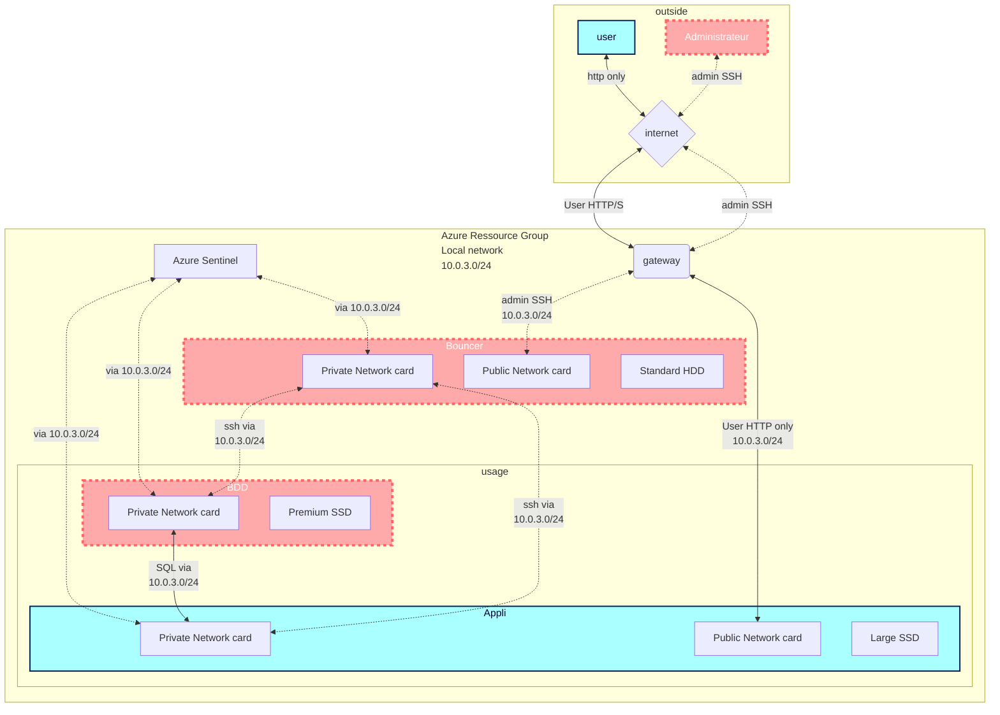

# Collaborative creation of Nextcloud VMs

    Demande utilisateur :

    Dans le cadre du projet “LifeSense”, nous avons besoin d’échanger des gros fichiers (plusieurs GO). Nous souhaitons le faire sans 
    passer par un drive tierce, de façon simple par un navigateur web, avec des accès sécurisés par utilisateur.

## ***Sommaire***

***[1 - Topologie du réseau sur Azure en Flowchart](#NetFlo)*** 

***[2 - Ressources nécessaires prévues](#Res)***

***[3 - Plan d'action](#Actplan)***

***[X - Commandes prévues](https://github.com/simplon-lanloBaptiste/Brief2_groupe3/blob/main/Commandes%20pr%C3%A9vues)***

## ***1 - Topologie du réseau sur Azure en Flowchart***

[Retour au sommaire](#home)

## ***2 - Liste des ressources Azure prévues à déployer***

    - 3 VM Ubuntu 20
          - 2 VM avec 64Gb Standard SDD - Dual Core - 8Gb RAM
            - 1 VM d'Administration "rebond" pour accéder aux 2 autres en SSH
          - 1 VM avec 128Gb Premium SSD - Dual Core - 16Gb RAM
            - VM de Base de Donnée en MariaBD
    - 1 virtual network
    - 1 virtual gateway
    - 3 adresses IP publiques (1 temporaire)
    - 1 Azure Sentinel  

[Retour au sommaire](#home)

## ***3 - Plan d'action :***

        - Planifier les actions et quelles ressources mettre en place
 
        - Créer le schéma réseau

        - Créer 3 VMs pour NextCloud
            - 1 VM Admin
            - 1 VM BDD
            - 1 VM Applicative

        - Déployer NextCloud sur la VM Applicative, MariaDB sur la VM BDD

        - Créer les utilisateurs/groupes et accorder les droits d’accès

        - Création des clés SSH pour les différents Users

        - Configurer les accès au réseau des VMs
            - Modifier les ports d'accès (10022 au lieu de 22/ 10080 au lieu de 80...)
            - Couper l'accès SSH public aux VMs Appli et BDD
 
        - Tester la structure
            - Accès au portail web NextCloud en tant que "user" (http/10080)
            - Vérification du logging d'Azure Sentinel
            - Test de disponibilité Application Insights

        - Accès à l'application via TLS (HTTPS)

        - Création des différentes documentations

        - Répondre au client

Commentaire : représenter le réseau à déployer sous forme de tableau (adressages IPs, ports, etc)

[Retour au sommaire](#home)

