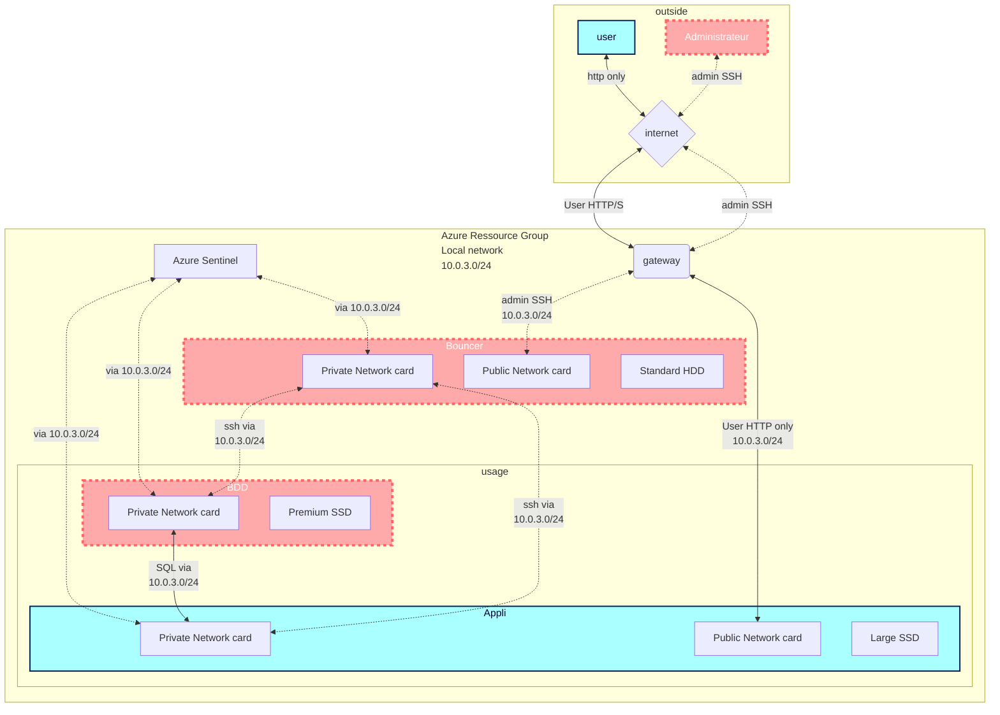

# Collaborative creation of Nextcloud VMs

    Demande utilisateur :

    Dans le cadre du projet “LifeSense”, nous avons besoin d’échanger des gros fichiers (plusieurs GO). Nous souhaitons le faire sans 
    passer par un drive tierce, de façon simple par un navigateur web, avec des accès sécurisés par utilisateur.

___

## ***Sommaire<a name="home"></a>***

***[1 - Topologie du réseau sur Azure en Flowchart](#NetFlo)*** 

***[2 - Ressources nécessaires prévues](#Res)***

***[3 - Plan d'action](#Actplan)***

***[4 - Création d'une VM via le portail Azure](#Crea)***

***[5 - Pour changer le port 22 en 10022](#Port22)***

***[6 - Documentation Génération de clé privée/publique](#Keygen)***

***[7 - Configuration d'une paire de clé SSH](#SSH)***

***[8 - Création d'un user Admin](#userAdmin)***

***[9 - Installation de PHP](#PHP)***

***[10 - Installation MariaDB](#MDB)***

***[11 - Création et configuration nextcloud.conf](#Nextconf)***

***[12 - Transfert et extraction nextcloud.tar.bz2](#Nexttar)***

***[X - Commandes prévues](https://github.com/simplon-lanloBaptiste/Brief2_groupe3/blob/main/Commandes%20pr%C3%A9vues.md)***

___

## ***1 - Topologie du réseau sur Azure en Flowchart***<a name="NetFlo"></a>



[Retour au sommaire](#home)

___

## ***2 - Liste des ressources Azure prévues à déployer***<a name=Res></a>

    - 3 VM Ubuntu 20
            - 1 VM Admin bastion pour accès SSH aux autres VMs avec
                - 1vCPU
                - 3.5Gb RAM
                - 1 disque OS 30Gb standard HDD
                - 1 disque data 32Gb standard HDD
            - 1 VM Appli avec 
                - 2vCPU
                - 8Gb RAM
                - 1 disque OS 30Gb standard HDD
                - 1 disque data 256Gb Premium SSD
            - 1 VM de Base de Donnée en MariaBD avec
                - 2vCPU
                - 16Gb RAM
                - 1 disque OS 30Gb standard HDD
                - 1 disque data 32Gb standard SSD
    - 1 virtual network
        - masque de sous réseau 10.0.3.0/24
    - 1 virtual gateway
    - 3 adresses IP publiques (1 temporaire), cf table ip ci dessous
    - 1 Azure Sentinel  

Table d'adressage IP :  

| VM | Private IP | Public IP |
| :--- | :---: | ---: |
| Admin | 10.0.3.4 | 20.150.147.129 |
| Appli | 10.0.3.5 | 20.118.188.191 |
| BDD | 10.0.3.6 | 20.125.132.145 |

[Retour au sommaire](#home)

___

## ***3 - Plan d'action :<a name="Actplan"></a>***
<br></br>
- [x] Planifier les actions et quelles ressources mettre en place
<br></br> 
- [x] Créer le schéma réseau
<br></br>
- [x] Création des clés SSH
    - [x] Pour accéder au serveur de rebond
    - [x] Depuis le serveur de rebond vers VM Appli
    - [x] Depuis le serveur de rebond vers VM BDD 
<br></br>
- [x] Créer 3 VMs pour NextCloud
    - [x] 1 VM Admin
    - [x] 1 VM BDD
    - [x] 1 VM Applicative
<br></br>

- [x] Configurer les accès au réseau des VMs
  - [x] Modifier les ports d'accès 
    - [x] 10022 au lieu de 22
    - [x] 10080 au lieu de 80...)
    - [x] Couper l'accès SSH public aux VMs Appli et BDD
<br></br>
- [x] Installation des prérequis
    - [x] PHP8.0
    - [x] Apache2
    - [x] Créer une base de données MariaDB sur la VM BDD
    - [x] Déployer NextCloud sur la VM Applicative
<br></br>
- [x] Créer les utilisateurs/groupes et accorder les droits d’accès
<br></br>
- [ ] Tester la structure
    - [x] Accès au portail web NextCloud en tant que "user" (http/10080)
    - [ ] Vérification du logging d'Azure Sentinel
    - [ ] Test de disponibilité Application Insights
<br></br>
- [ ] Accès à l'application via TLS (HTTPS)
<br></br>
- [ ] Création des différentes documentations
<br></br>
- [ ] Répondre au client
<br></br>

[Retour au sommaire](#home)

___

## ***04 - Création d'une VM via le portail Azure<a name="Crea"></a>***


### ***04-1 - Informations basiques***
___
All resources > Create > Virtual machine  

  

Choisir "subscription" et "resource group"  

  

Choisir un nom pour la VM, la "Region" (localisation des services), l'image...  

  

Créer un compte admin (user name, password)  

  

Puis choisir les règles de port entrantes (HTTP/HTTPS/SSH)  

### ***04-2 - Disques***
___
Choisir un type de disque système :  

  

Puis ajouter au moins 1 disque DATA :  

  

  

### ***04-3 - Réseau***
___
Choisir le "virtual network", le "subnet" et l ressource Azure "public ip" (faire "new" si pas de ressource déjà existante)  

  

Choisir quels ports entrants seront autorisés au déploiement de la VM :  

  

### ***04-4 - Création de la VM***
___
Si tout est conforme, passer à "review and create", un résumé du produit et du prix est visible (voir screenshot), et toutes les informations relatives à la VM sont résumées plus bas dans la page du portail Azure  

  

### ***04-5 - Vérification des ressources***
___
Si tout s'est bien déroulé, nous allons pouvoir retrouver la vm et les ressources automatiquement créées dans "all resources", en filtrant sur notre "resource group" :  

  

  

Exemple :  

| NAME | TYPE | RESOURCE GROUP | LOCATION | SUBSCRIPTION |
| --- | --- | --- | --- | --- |
| VMAdminB2G3 | Virtual machine | brief_2_groupe_3 | West US 3 | Simplon OCC Montpellier ADMIN CLOUD |
| VMAppliB2G3 | Virtual machine | brief_2_groupe_3 | West US 3 | Simplon OCC Montpellier ADMIN CLOUD |

[Lien vers l'extract en .csv](https://github.com/simplon-lanloBaptiste/Brief2_groupe3/blob/main/DOC/AzureresourcesBrief2.csv)  


[Retour au sommaire](#home)

___

## ***05 - Pour changer le port 22 en 10022 :<a name="port22"></a>***

Editer le fichier

    /etc/ssh/sshd_config  

Retrouver la ligne qui contient "Port 22" (sous VIM, faire une recherche avec /)  

Enlever le # en début de ligne (il sert à "commenter" une ligne, elle ne sera donc pas prise en compte tant que "#" est là)

Remplacer la ligne par "Port 10022"  

    groupe3@VMAdminB2G3:~$ cat /etc/ssh/sshd_config
    # $OpenBSD: sshd_config,v 1.103 2018/04/09 20:41:22 tj Exp $

    # This is the sshd server system-wide configuration file.  See
    # sshd_config(5) for more information.

    # This sshd was compiled with PATH=/usr/bin:/bin:/usr/sbin:/sbin

    # The strategy used for options in the default sshd_config shipped with
    # OpenSSH is to specify options with their default value where
    # possible, but leave them commented.  Uncommented options override the
    # default value.

    Include /etc/ssh/sshd_config.d/*.conf

    Port 10022
    #AddressFamily any
    #ListenAddress 0.0.0.0
    #ListenAddress ::
  
Ensuite la machine sera normalement inaccessible tant que le port 10022 n'est pas autorisé via Azure. Pour l'autoriser, il va falloir ajouter une règle dans la ressource "network security group" associée à la VM Admin :

  

Création de la règle : cliquer sur +Add

  

Il faut changer le port "destination" en 10022 :

  

Ensuite changer la "priority" (plus le nombre est bas, plus la règle est prioritaire) et nommer la nouvelle règle :

  

Une fois que tous les champs sont remplis, cliquer sur "Add"

[Retour au sommaire](#home)

___
## ***06 - Documentation Génération de clé privée/publique du serveur<a name="Keygen"></a>***

Tout d'abord il faut créer les clés.


Cliquez alors sur "generate" puis bouger la souris (dans la fenêtre) pour générer la clé. Une fois générée vous obtiendrez alors ceci :


Cliquer sur "sauvegarder clef privée" puis vous pouvez fermer "PuTTYGen", une fois fait rouvrir putty et aller dans "ssh" puis "auth". Cliquez ensuite sur "browse" et mettez le chemin de votre clef.


Une fois fait retourner dans "session" et "save".


Votre clef privée est parametrée sur putty.

___

## ***07 - Configuration d'une paire de clé SSH<a name="SSH"></a>***

#### ***07-1 - Une fois sur ma machine, je rentre mon login pour me connecter.***


#### ***07-2 - Pour créer une paire de clés SSH sur ma Vm, je vais rentrer la commande ssh-keygen.***


#### ***07-3 - Je vais ensuite lui indiquer le chemin où je veux sauvgarder ma clé.***


#### ***07-4 - Une fois le bon chemin donné, il est demandé d'entrer une phrase secrète, je peux également laisser la zone vide si je ne souhaite pas utiliser de phrase secrète.***


[Retour au sommaire](#home)
___

## ***08 - Création d'un utilisateur admin :<a name="userAdmin"></a>***

Création du user :  
```console
sudo useradd -m -d /home/alain alain
```

Pour ajouter le user aux mêmes groupes que notre utilisateur administrateur nous avons créé une boucle qui liste les groupes en question et ajoute l'utilisateur à chacun de ces groupes :  

```console
for groupe in `cat /etc/group | grep -i groupe3 | awk -F ':' '{print $1}'`;do usermod -a -G ${groupe} alain;done;
```

Pour pouvoir activer la clé ssh :  
Créer un répertoire .ssh dans le home  
```console
sudo mkdir ~/.ssh  
```

Changer le propriétaire du répertoire /home/[utilisateur]/.ssh

```console
sudo chown $USER:$USER ~/.ssh -R
chmod 700 /home/alain/.ssh  
chmod 600 /home/alain/.ssh/authorized_keys  
```

Ensuite, soit : créer un fichier authorized_keys (commande touch), soit : dans notre cas, j'ai récupéré celui du premier user que nous avions créé :  
```console
cp /home/groupe3/.ssh/* /home/alain/.ssh/
```

Le fichier contient déjà la clé publique associée à l'hôte utilisé pour la connexion en ssh  
relancer le daemon ssh :  

```console
sudo service ssh restart
```

Désormais le user "alain" peut se connecter via la clé ssh sur la vm Admin  


[Retour au sommaire](#home)
___

## ***9 - Installation de PHP :<a name="PHP"></a>***

En suivant le [guide d'installation de NextCloud](https://docs.nextcloud.com/server/latest/admin_manual/installation/source_installation.html#prerequisites-for-manual-installation), nous avons dans un premier temps identifié quels composants / programmes étaient déjà installés. PHP est présent en version 1, nous avons choisi d'installer la version la plus récente en 8.0  en suivant [ce guide](https://linuxize.com/post/how-to-install-php-8-on-ubuntu-20-04/) qui explique bien les prérequis et les étapes d'installation de PHP et de ses diffétents modules.  

Les commandes utilisées sont :  

    sudo apt install software-properties-common
    sudo add-apt-repository ppa:ondrej/php
    sudo apt install php8.0

Pour continuer nous avons retrouvé la liste de tous les modules déjà installés :  

    php8.0 -m

  

Ensuite nous avons identifié les modules prérequis à l'installation de NextCloud manquants et les avons installés manuellement via la commande :  

    sudo apt install php8.0-[nom du module]


[Retour au sommaire](#home)

___


## ***10 - Installation MariaDB<a name="MDB"></a>***

### ***10-1 - Installation MariaDB(server) et MySQL***
Sur la vm BDD  

    sudo apt update
    sudo apt install mariadb-server
    sudo mysql_secure_installation

  

  

  

  

### ***10-2 - Démarrage MariaDB***

démarrage du démon MariaDB

    groupe3@VMBDDB2G3:~$ sudo systemctl start mariadb

check du démarrage du service MariaDB :

    groupe3@VMBDDB2G3:~$ sudo systemctl status mariadb

### ***10-3 - Création DB***

Création de la base de données :  

Il faut lancer une instance MySQL

    groupe3@VMBDDB2G3:~$ sudo MySQL
    Welcome to the MariaDB monitor.  Commands end with ; or \g.
    Your MariaDB connection id is 41
    Server version: 10.3.34-MariaDB-0ubuntu0.20.04.1 Ubuntu 20.04

    Copyright (c) 2000, 2018, Oracle, MariaDB Corporation Ab and others.

    Type 'help;' or '\h' for help. Type '\c' to clear the current input statement.

    MariaDB [(none)]>

Nous ***ne sommes plus en "bash"*** (groupe3@VMBDDB2G3:~$), désormais la console ne comprend ***que les commandes MySQL.***  

Puis créer la base de données (nommée G3B2BDD dans notre cas)  

    MariaDB [(none)]> CREATE DATABASE G3B2BDD;
    Query OK, 1 row affected (0.000 sec)

    MariaDB [(none)]> SHOW DATABASES;
    +--------------------+
    | Database           |
    +--------------------+
    | G3B2BDD            |
    | information_schema |
    | mysql              |
    | performance_schema |
    +--------------------+
    4 rows in set (0.000 sec)


[Retour au sommaire](#home)

___


## ***11 - Apache Web server configuration sur VM Appli<a name="Nextconf"></a>***

### ***11-1 - Création du fichier de configuration***

Créer le fichier "nextcloud.conf" à l'aide d'un "touch" et la commande 

    sudo touch /etc/apache2/sites-available/nextcloud.conf

"sudo" car /etc/ est protégé.


### ***11-2 - Configuration du fichier de configuration***

Utiliser VIM pour éditer le nouveau fichier "nextcloud.conf" et rajouter les informations nécessaire en changeant, si besoin, les chemins d'accès:  

<VirtualHost *:8080>
        DocumentRoot /var/www
        Alias /nextcloud "/var/www/nextcloud/"
        <Directory /var/www/nextcloud/>
                Satisfy Any
                Require all granted
                AllowOverride All
                Options FollowSymLinks MultiViews

                <IfModule mod_dav.c>
                        Dav off
                </IfModule>
        </Directory>
        ErrorLog ${APACHE_LOG_DIR}/error.log
        CustomLog ${APACHE_LOG_DIR}/access.log combined
</VirtualHost>

A l'aide cette commande :

    vim /etc/apache2/sites-available/nextcloud.conf


___

### ***11-3 - Pour changer le port 88 en 8080***


[Retour au sommaire](#home)


### ***11-4 - Création du dossier pré-requis à l'installation***

Créer le dossier nextcloud dans "var/www/" avec "sudo" car protégé et vérification de sa présence et des droits avec "ls -la".

    sudo mkdir var/www/nextcloud


### ***11-5 - Intégration au démon***

Activer le module "mod_rewrite" avec la commande : (en sudo à nouveau pour permissions)

    sudo a2enmod rewrite

Ce qui permet de mettre à jour le lien symbolique d'Apache vers sa bibliothèque.


Redémarer le démon Apache avec la commande :

    sudo systemctl reload apache2


Vérifier que le démon tourne bien

    ps -ef | grep apache


(Tutoriel suivi : https://docs.nextcloud.com/server/latest/admin_manual/installation/source_installation.html#additional-apache-configurations)


[Retour au sommaire](#home)

___

## ***12 - Transfert et extraction nextcloud.tar.bz2<a name="Nexttar"></a>***

### ***12-1 - Transfert user->VM Admin***

Placer l'archive récupérée sur le site de nextcloud sur la VM Admin, possible via Filezilla (nous mettrons l'archive dans le /home)  

  

  

  

### ***12-2 - Transfert VM Admin -> VM Appli*** 

Depuis la console vm Admin, récupérer le chemin absolu vers l'archive à déplacer vers la vm Appli :  

    groupe3@VMAdminB2G3:~/ncfiles$ readlink -f latest.tar.bz2
    /home/groupe3/ncfiles/latest.tar.bz2
 
Puis se connecter en sftp à la VM Appli et uploader l'archive vers le /home de la vm distante :  

    groupe3@VMAdminB2G3:~/ncfiles$ sftp groupe3@10.0.3.5
    Connected to 10.0.3.5.
    sftp> put /home/groupe3/ncfiles/latest.tar.bz2
    Uploading /home/groupe3/ncfiles/latest.tar.bz2 to /home/groupe3/latest.tar.bz2
    /home/groupe3/ncfiles/latest.tar.bz2                                       100%  118MB  87.8MB/s   00:01

Ensuite se connecter à la VM Appli et vérifier l'existence du fichier dans le /home :  

    groupe3@VMAppliB2G3:~$ ls -lrt|grep tar
    -rwxrw-r-- 1 groupe3 groupe3 123445625 Jul  8 11:49 latest.tar.bz2
 
Si besoin changer les droits d'accès avec chmod

Ensuite déplacer l'archive vers sa destination. Comme nous souhaitons déployer NextCloud dans /var/www/ qui est normalement réservé système, ne pas oublier le sudo

    groupe3@VMAppliB2G3:~$ sudo mv ./latest.tar.bz2 /var/www/
    groupe3@VMAppliB2G3:~$ ls /var/www/ | grep tar
    latest.tar.bz2

### ***12-3 - Extraction du tar.bz2***

Nous poursuivons avec l'extraction des fichiers nextCloud en utilisant la commande "tar" :
(x pour extract, v pour verbose : donne un récap des actions de la commande en temps réel, f pour "file", -C pour indiquer le chemin vers où extraire le fichier)  

    sudo tar xvf ./latest.tar.bz2 -C /var/www/nextcloud/
    [...]
    nextcloud/3rdparty/microsoft/azure-storage-blob/src/Blob/Models/AccessCondition.php
    nextcloud/3rdparty/microsoft/azure-storage-blob/src/Blob/Models/DeleteBlobOptions.php
    nextcloud/3rdparty/microsoft/azure-storage-blob/src/Blob/Models/UndeleteBlobOptions.php
    nextcloud/3rdparty/microsoft/azure-storage-blob/src/Blob/Models/CreateContainerOptions.php
    nextcloud/3rdparty/microsoft/azure-storage-blob/src/Blob/Models/CreateBlockBlobOptions.php
    nextcloud/3rdparty/microsoft/azure-storage-blob/src/Blob/Models/CopyState.php
    nextcloud/3rdparty/microsoft/azure-storage-blob/src/Blob/Models/GetBlobPropertiesResult.php
    [...]


Quand la console rend la main, se placer dans le bon répertoire et vérifier la présence des fichiers :  

    groupe3@VMAppliB2G3:/var/www/nextcloud/nextcloud$ ls -la
    total 176
    drwxr-xr-x 14 nobody nogroup  4096 Jun 20 15:29 .
    drwxr-xr-x  3 root   root     4096 Jul  8 09:27 ..
    -rw-r--r--  1 nobody nogroup  3253 Jun 20 15:01 .htaccess
    -rw-r--r--  1 nobody nogroup   101 Jun 20 15:01 .user.ini
    drwxr-xr-x 43 nobody nogroup  4096 Jun 20 15:29 3rdparty
    -rw-r--r--  1 nobody nogroup 19327 Jun 20 15:01 AUTHORS
    -rw-r--r--  1 nobody nogroup 34520 Jun 20 15:01 COPYING
    drwxr-xr-x 48 nobody nogroup  4096 Jun 20 15:07 apps
    drwxr-xr-x  2 nobody nogroup  4096 Jun 20 16:01 config
    -rw-r--r--  1 nobody nogroup  4095 Jun 20 15:01 console.php
    drwxr-xr-x 22 nobody nogroup  4096 Jun 20 15:41 core
    -rw-r--r--  1 nobody nogroup  6260 Jun 20 15:01 cron.php
    drwxr-xr-x  2 nobody nogroup 12288 Jun 20 15:01 dist
    -rw-r--r--  1 nobody nogroup   156 Jun 20 15:01 index.html
    -rw-r--r--  1 nobody nogroup  3456 Jun 20 15:01 index.php
    drwxr-xr-x  6 nobody nogroup  4096 Jun 20 15:01 lib
    -rw-r--r--  1 nobody nogroup   283 Jun 20 15:01 occ
    drwxr-xr-x  2 nobody nogroup  4096 Jun 20 15:01 ocm-provider
    drwxr-xr-x  2 nobody nogroup  4096 Jun 20 15:01 ocs
    drwxr-xr-x  2 nobody nogroup  4096 Jun 20 15:01 ocs-provider
    -rw-r--r--  1 nobody nogroup  3139 Jun 20 15:01 public.php
    -rw-r--r--  1 nobody nogroup  5340 Jun 20 15:01 remote.php
    drwxr-xr-x  4 nobody nogroup  4096 Jun 20 15:01 resources
    -rw-r--r--  1 nobody nogroup    26 Jun 20 15:01 robots.txt
    -rw-r--r--  1 nobody nogroup  2452 Jun 20 15:01 status.php
    drwxr-xr-x  3 nobody nogroup  4096 Jun 20 15:01 themes
    drwxr-xr-x  2 nobody nogroup  4096 Jun 20 15:07 updater
    -rw-r--r--  1 nobody nogroup   382 Jun 20 15:28 version.php
    [...]

[Retour au sommaire](#home)

___


